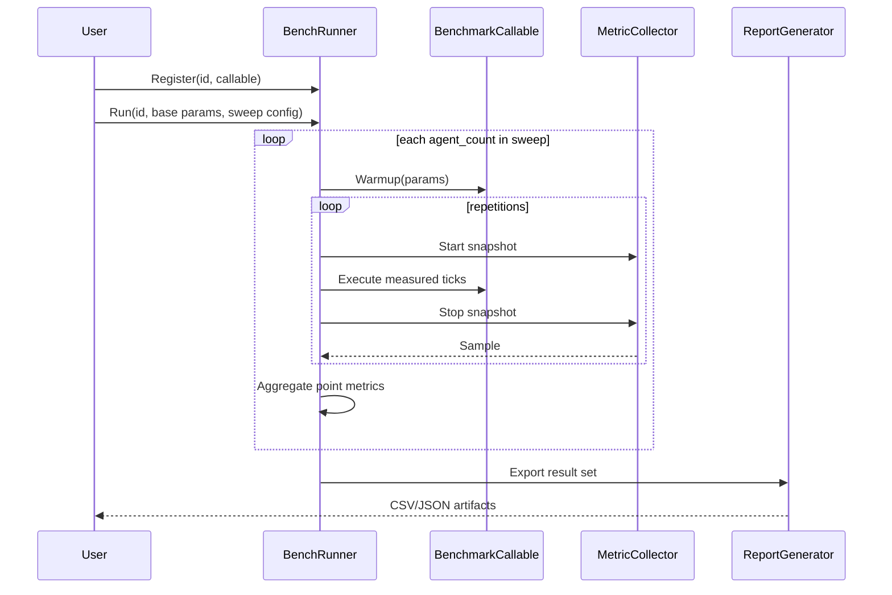

# BenchRunner Architecture Spec (Phase 1)

## Purpose

Define the implementation-ready contract for the first BenchRunner deliverables:

- `Params` data contract
- `BenchRunner` header surface and responsibilities

All benchmarking-related artifacts remain in this `benchmarking/` directory.

## Scope

This phase includes:

- Stable `Params` schema for experiment and execution loops
- Public API contract for `BenchRunner` registration and execution
- Data contracts between `BenchRunner`, `MetricCollector`, and `ReportGenerator`

This phase excludes:

- Concrete `.cpp` implementation logic
- CSV/JSON writer internals
- Trend analysis internals

## AI-First Assessment

Confidence: HIGH

AI/agentic architecture is not selected for this phase because:

- The workload is deterministic systems benchmarking with strict reproducibility needs.
- Runtime overhead must remain low and measurable.
- The primary value is stable metrics collection and controlled experiment loops, which are better served by direct C++ orchestration.

## File Placement

Confidence: HIGH

| Artifact                | Location                           | Rationale                                                              |
| ----------------------- | ---------------------------------- | ---------------------------------------------------------------------- |
| BenchRunner header      | `benchmarking/BenchRunner.hpp`     | Keeps benchmark orchestration isolated from simulation runtime modules |
| BenchRunner source      | `benchmarking/BenchRunner.cpp`     | Encapsulates execution-loop policy                                     |
| Shared benchmark types  | `benchmarking/BenchmarkTypes.hpp`  | Optional split if `Params` is reused by multiple modules               |
| Metric collector header | `benchmarking/MetricCollector.hpp` | Dedicated metrics boundary                                             |
| Report generator header | `benchmarking/ReportGenerator.hpp` | Dedicated export boundary                                              |

## Params Contract

Confidence: HIGH

`Params` is the canonical experiment input object passed to registered benchmark functions.

### Required fields

| Field            | Type Category    | Purpose                                     | Validation Rule                |
| ---------------- | ---------------- | ------------------------------------------- | ------------------------------ |
| `benchmark_name` | text             | Logical scenario identifier                 | Non-empty                      |
| `agent_count`    | unsigned integer | Independent variable for scalability sweep  | `>= 1`                         |
| `tick_count`     | unsigned integer | Number of simulation ticks per measured run | `>= 1`                         |
| `warmup_ticks`   | unsigned integer | Untimed stabilization loop before timing    | `>= 0`                         |
| `repetitions`    | unsigned integer | Number of measured runs for averaging       | `>= 1`                         |
| `seed`           | unsigned integer | Reproducible randomness control             | Valid full-width integer value |

### Optional fields (recommended)

| Field        | Type Category    | Purpose                        | Validation Rule |
| ------------ | ---------------- | ------------------------------ | --------------- |
| `agent_step` | unsigned integer | Sweep interval for agent count | `>= 1`          |
| `notes`      | text             | Human-readable run metadata    | Optional        |
| `tags`       | list of text     | Scenario grouping/filtering    | Optional        |

### Invariants

| Invariant                                                         | Reason                              |
| ----------------------------------------------------------------- | ----------------------------------- |
| `warmup_ticks` must not exceed practical runtime budget           | Prevent accidental excessive warmup |
| `repetitions` should be fixed across a sweep                      | Preserve cross-point comparability  |
| `tick_count` should remain constant for a given benchmark run set | Preserve scaling signal quality     |

## BenchRunner Header Contract

Confidence: HIGH

### Responsibility boundaries

| Responsibility                       | Owned By        | Notes                                            |
| ------------------------------------ | --------------- | ------------------------------------------------ |
| Benchmark registration               | BenchRunner     | Registry pattern keyed by benchmark id           |
| Hyperparameter sweep loop            | BenchRunner     | Iterates agent-count range and prepares `Params` |
| Warmup + measured execution flow     | BenchRunner     | Enforces untimed warmup then timed repetitions   |
| Timing and RSS measurement internals | MetricCollector | BenchRunner consumes results only                |
| Aggregation and export               | ReportGenerator | BenchRunner delegates final write/export         |

### Public API surface (conceptual)

| API                 | Input                                              | Output                      | Behavior Contract                                                     |
| ------------------- | -------------------------------------------------- | --------------------------- | --------------------------------------------------------------------- |
| Register benchmark  | benchmark id + callable accepting mutable `Params` | success/failure status      | Duplicate ids are rejected or explicitly replaced by policy           |
| Run benchmark by id | baseline `Params` + sweep configuration            | per-point result collection | Performs warmup + repeated measured runs per sweep point              |
| Run all benchmarks  | baseline `Params` + sweep configuration            | grouped result collection   | Deterministic execution order by insertion order or sorted key policy |
| Configure policies  | warmup/repetition/seed/report options              | none                        | Updates runner-level defaults applied to future runs                  |

### Error model

| Condition                              | Required Behavior                                     |
| -------------------------------------- | ----------------------------------------------------- |
| Unknown benchmark id                   | Return typed error status; do not crash               |
| Invalid params (e.g., `agent_count=0`) | Validate early and reject run                         |
| Benchmark callable throws/fails        | Capture failure in run result and continue per policy |
| Metric snapshot failure                | Mark run as invalid and surface diagnostics           |

## Metric and Result Contracts

Confidence: MEDIUM

### Per repetition metric sample

| Field            | Meaning                                          |
| ---------------- | ------------------------------------------------ |
| `wall_time_ns`   | Measured wall-clock duration in nanoseconds      |
| `rss_delta_kb`   | Delta resident set size across run               |
| `valid`          | Whether the sample is acceptable for aggregation |
| `failure_reason` | Optional diagnostics for invalid samples         |

### Aggregated result per sweep point

| Field                 | Meaning                               |
| --------------------- | ------------------------------------- |
| `agent_count`         | Sweep point                           |
| `avg_wall_time_ns`    | Mean runtime across valid repetitions |
| `min_wall_time_ns`    | Fastest valid repetition              |
| `max_wall_time_ns`    | Slowest valid repetition              |
| `stddev_wall_time_ns` | Timing spread for stability analysis  |
| `avg_rss_delta_kb`    | Mean memory delta                     |
| `samples_used`        | Number of valid repetitions included  |

## Sequence View

Confidence: HIGH

## Design Decisions

| Decision                                                   | Confidence | Rationale                                                    |
| ---------------------------------------------------------- | ---------- | ------------------------------------------------------------ |
| `Params` passed as mutable reference to benchmark callable | HIGH       | Matches plugin model and allows benchmark-local setup tuning |
| BenchRunner delegates timing and memory reads              | HIGH       | Keeps orchestration separate from instrumentation mechanics  |
| Aggregation occurs per sweep point before export           | HIGH       | Simplifies downstream reporting and trend checks             |
| Deterministic run order policy is explicit                 | MEDIUM     | Supports reproducible regression comparisons                 |

## Open Questions

| Question                                                                | Impact                                    | Answer                                                                        |
| ----------------------------------------------------------------------- | ----------------------------------------- | -----------------------------------                                           |
| Should duplicate registration replace existing benchmarks or hard-fail? | Affects API ergonomics and safety         | Replace existing benchmarks                                                   |
| Should failed repetitions be retried automatically?                     | Affects statistical integrity and runtime | No, do not retry automatically                                                |
| Should report export be synchronous or buffered?                        | Affects UX for large benchmark sets       | buffer during the run and then synchronously write the report at the very end.|

## Implementation Readiness Checklist

- `Params` fields and validation rules approved
- BenchRunner public API behavior approved
- Error-handling policy approved
- Result schema approved for CSV/JSON mapping
