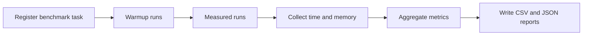

# Benchmarking Feature Documentation

## Purpose

This project includes a dedicated benchmarking feature to measure simulation scalability.
The primary question it answers is: how runtime and memory usage change as agent count increases.

## Scope

- Language: Modern C++ (C++20/23)
- Runtime environment: Linux and Docker-compatible
- Focus metrics: wall-clock time and memory delta
- Design goal: easy plug-in workflow for group-authored benchmark files

## How Benchmarking Is Implemented

### 1) BenchRunner (orchestration layer)

BenchRunner manages the full benchmark lifecycle:

- Registers benchmark tasks by name
- Runs warmup iterations (untimed)
- Runs measured iterations (timed)
- Aggregates execution statistics
- Supports one-call run-and-report workflow

### 2) MetricCollector (measurement layer)

MetricCollector captures runtime metrics during benchmark execution:

- Wall time using high-resolution clock timing
- Memory usage using RSS snapshots from system resource data

### 3) ReportGenerator (export layer)

ReportGenerator converts benchmark results into persistent reports:

- CSV output for spreadsheet analysis
- JSON output for tooling and automation

### 4) Group benchmark workspace

Group benchmark entry files live in the groups workspace under the benchmarking feature.
Each file plugs into the same runner and report flow, so teams can add benchmarks without changing framework internals.

## Execution Flow

## Build and Integration Model

- Benchmarking is exposed through an independent Makefile benchmark target.
- Benchmark builds use optimized compilation settings.
- Benchmark mode excludes GUI-focused paths to keep measurements consistent.
- Benchmarking is separate from Docker CI execution flow, even though both use the same source tree.

## Outputs

- Result files are written to the benchmarking results location in the groups workspace.
- Reports are intended for:
  - professor review
  - cross-group comparison
  - regression tracking over time

## Why This Design

- Modular: measurement, orchestration, and export are separate concerns
- Extensible: groups can add new benchmark files without touching core modules
- Reproducible: standardized run flow and report format across teams
- Concise to use: register benchmark task, run benchmark, write report
