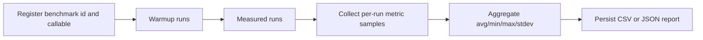

# Benchmarking Feature Documentation

## Purpose

The benchmarking module measures how simulation cost changes with workload size.
It is designed to answer two practical questions:

- How does execution time scale as agent count and tick count increase?
- How does memory behavior change across repeated runs?

## Current Architecture

The implementation is split across three core modules:

- BenchRunner: registration, execution, aggregation, and optional report writing.
- MetricCollector: captures wall-clock duration and RSS-based memory snapshots.
- ReportGenerator: writes normalized benchmark output in CSV or JSON.

Core headers are in benchmarking/core/:

- BenchmarkTypes.hpp
- BenchRunner.hpp
- MetricCollector.hpp
- ReportGenerator.hpp

## Data Model Summary

The benchmark pipeline currently uses these types from BenchmarkTypes.hpp:

- Params: benchmark_name, agent_count, tick_count, warmup_ticks, repetitions, seed.
- MetricSample: wall_time_ns, memory_usage_kb, current_rss_at_stop_kb, success, error_message.
- BenchmarkResult: aggregated averages, min, max, and standard deviation for each metric.
- RunStatus and RegistrationResult: explicit status enums for registration and execution outcomes.

## Execution Flow

## How To Run

From repo root:

- make benchmark BENCH_FILE=example_1.cpp
- make benchmark BENCH_FILE=groups/example_1.cpp

This uses the source Makefile benchmark target and builds with Release settings, NO_QT=ON, and benchmark-specific flags.

## Output Location

Default report output path from BenchRunner::RunBenchmarkAndWriteReport is:

- ../benchmarking/groups/results

Group benchmark examples are in benchmarking/groups/ and include:

- example_1.cpp
- example_2.cpp
- StepMazeWorldBenchmark.cpp

## Report Fields

Current CSV/JSON exports include:

- benchmark_name
- Params fields: agent_count, tick_count, warmup_ticks, repetitions, seed
- Time stats: avg_wall_time_ns, min_wall_time_ns, max_wall_time_ns, stdev_wall_time_ns
- Memory stats: avg_memory_usage_kb, min/max/stdev_memory_usage_kb
- RSS-at-stop stats: avg_current_rss_at_stop_kb, min/max/stdev_current_rss_at_stop_kb
- sample_count

## Interpreting Results

See Benchmarking result interpretation guide:

- benchmarking/BenchmarkResultsInterpretation.md

That guide explains what each metric means, how to detect scaling issues, and how to compare two runs safely.

## Design Goals

- Modular responsibilities across run, measurement, and report stages.
- Group-extensible benchmark entry points with minimal framework changes.
- Reproducible output format for review, comparison, and regression tracking.
